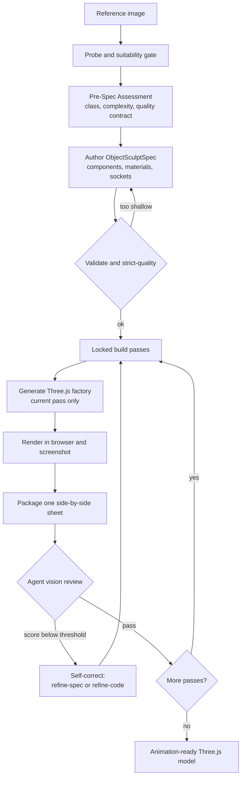

# img2threejs

Rebuild the object in a reference image as a **code-only, procedural Three.js model** — quality-gated, animation-ready, and deliberately token-efficient. This is reconstruction-by-code, not photogrammetry, mesh extraction, or downloaded art packs.


*Above: a single reference image reconstructed in code — correct proportions, colours, bevels, gold trim, and an emissive emblem — running live in the browser.*

---

## What it does

You give it one reference image of an object. It produces a `THREE.Group` factory written in TypeScript that recreates that object from primitives, procedural shaders, and generated geometry — with a runtime hierarchy (pivots, sockets, colliders) so the result is ready to animate, not an inert lump.

It works under Claude Code, Codex, or OpenCode. It is agent-agnostic: wherever the docs say "agent vision" or "agent browser tool", it uses whatever the host provides (native image reading, a browser MCP, the project preview, or a user-supplied screenshot).

---

## Subjects and detail accuracy (v1.1)

- Objects and characters. Each subject is classified `object`, `character`, or `hybrid`. Objects follow the hard-surface pipeline; characters route through an anatomy-aware track (head-unit proportions, facial landmarks, pose) documented in `references/character-reconstruction.md`.
- Detail-first analysis. Before code generation the pipeline enumerates a `detailInventory` of identity-defining small details (gloss, bevel/rounding, screws/rivets, engraved or painted linework, contours, stains and wear). Every detail must map to a real component or material entry, and a strict-quality gate blocks generation until the inventory is complete. Taxonomy: `references/detail-inventory.md`.
- Maximum likeness for a specific person or character. An opt-in projection-first path fits a parametric template to image landmarks, de-lights the photo, camera-matches the render, and projects the reference onto the mesh. A single image cannot guarantee 100 percent likeness, so the pipeline reports per-region confidence and asks for more views when it matters. Details and sources: `references/likeness-maximization.md`.

## Why it is token-efficient

Most image-to-3D agent loops burn tokens by asking the model to do mechanical work — re-reading the whole model every pass, scoring pixels, validating JSON by hand, re-running steps it already did. img2threejs pushes all of that into deterministic scripts and spends model tokens only where judgment is actually required.

- **Scripts enforce, the model judges.** Ten Python scripts handle validation, gating, spec authoring, PBR extraction, comparison-sheet packaging, and pipeline state. They never score visuals. The model's tokens go to one thing: looking at a single side-by-side sheet and deciding pass or fail.
- **Zero dependencies, zero install churn.** Every script is pure Python 3.10+ standard library. No pip, no PIL, no numpy, no Playwright. PNG read/write is done with `struct` and `zlib`. Nothing to install means nothing to debug in-context.
- **Pass-gated generation.** The code generator emits only the currently unlocked build pass. The model does not regenerate or re-read the entire model on every iteration — each step is small and scoped.
- **Fail fast, before codegen.** A strict-quality gate blocks shallow specs before a single line of Three.js is generated, so you never spend tokens rendering and re-doing a model that was underspecified from the start.
- **One image per review.** Each pass is judged from exactly one packaged comparison sheet (reference beside render), not a scattering of screenshots.
- **Text output, not binaries.** The result is diffable TypeScript plus a JSON spec — small, reviewable, and version-controllable, instead of multi-megabyte mesh files.

The net effect: you still get a faithful 3D model from an image, but the expensive model context is reserved for visual judgment and code, not bookkeeping.

## Token cost analysis

The numbers below are engineering estimates, not a measured benchmark. They are order-of-magnitude figures anchored to one reference build (a rounded-bevel loot chest: gradient enamel, gold corner brackets, an emissive emblem, resolved in about six render-review cycles). Actual cost varies with the model tier, image resolution, object complexity, and — above all — how many review cycles a subject needs. Treat them as a cost model, not a guarantee.

Where the tokens go per full object reconstruction (image to a verified 3D model):

| Stage | Est. model tokens | Notes |
| --- | --- | --- |
| Deterministic scripts (probe, assessment, spec, validate, generate, sync) | ~2k-5k total | Run as subprocesses. This is the work that is near-free. |
| Read the reference image | <1k | A small reference; higher-res costs more. |
| Author assessment + detail inventory + spec JSON | ~15k-25k | The spec is the largest text artifact. |
| Write and edit the Three.js factory | ~20k-45k | Scales with part count and edit iterations. |
| Render-review loop (5-8 cycles) | ~30k-70k | The dominant cost; scales linearly with cycles. |
| **Total, one object** | **~80k-180k** | Simple/few-cycles to complex/many-cycles. |

One render-review cycle in isolation:

| Step | Est. model tokens |
| --- | --- |
| Capture screenshot (browser tool) | ~0 (tool call) |
| Package comparison sheet (stdlib script) | ~0 (subprocess) |
| Inspect the comparison sheet with vision | ~2k-3k |
| Write the review and scores (script) | ~1k-2k |
| **Per cycle** | **~5k-12k** |

Characters cost more (more review cycles plus landmark and projection checks): roughly ~150k-350k for a full stylized/likeness reconstruction once the v1.2 character generator lands.

What this buys you:

- Deterministic scripts contribute close to zero model tokens, so validation, gating, detail counting, sheet packaging, and pipeline state never eat context.
- Model tokens are spent only on vision (reading one sheet per pass), authoring the spec, and writing code.
- The gates are the savings mechanism: strict-quality blocks codegen on an underspecified spec, and the detail-inventory gate blocks it on missing detail — each avoided bad render saves roughly one full cycle (~10k-20k tokens).
- The single biggest lever on cost is the review-cycle count. A well-formed spec up front is worth more tokens than any micro-optimization downstream.

---

## How it works

The skill runs a staged sculpting pipeline. Scripts gate each stage; the agent's vision is the only thing that can approve a pass.



### The build passes

The model is sculpted in a fixed order, and a pass only unlocks after the previous one is reviewed and accepted:

`blockout` to `structural-pass` to `form-refinement` to `material-pass` to `surface-pass` to `lighting-pass` to `interaction-pass` to `optimization-pass`

Each pass has its own acceptance criteria. A pass can be marked `continue` only with a real render, a comparison sheet, an agent-vision score at or above threshold, and every identity-defining feature at or above its own threshold.

### The gates

- **Suitability** — is the image a viable 3D target at all.
- **Pre-spec and strict-quality** — blocks code generation until the spec is deep enough for the object's complexity (no single-root spec for a compound object).
- **Screenshot feedback** — `continue` requires a render plus a comparison sheet plus a passing vision score.
- **Action-ready** — the model must expose a runtime hierarchy (pivots, sockets, colliders, destruction groups) via `root.userData.sculptRuntime`.
- **Attachment correctness** — child parts (handles, limbs, tubes) must declare how they join their parent, so nothing floats in mid-air.
- **Material and lighting realism** — independent PBR channels and real lights, never albedo aliased into roughness.

### Self-correction

After every pass the agent chooses exactly one action: `continue`, `refine-spec`, `refine-code`, `request-input`, or `stop`. `refine-spec` fixes a wrong or shallow spec and re-validates; `refine-code` fixes geometry, material, or lighting that does not match a sound spec.

---

## Quick start

1. **Install** — place this folder in your skills directory:

   ```bash
   git clone https://github.com/hoainho/img2threejs.git ~/.claude/skills/img2threejs
   ```

2. **Invoke** — in Claude Code, attach or point to an object image and run:

   ```
   /img2threejs Rebuild this object as a Three.js model, keep the proportions, angles, and colours.
   ```

3. **Follow the pipeline** — the skill validates the image, writes an assessment and spec, generates the factory pass by pass, and shows you a side-by-side comparison at each step until the render matches.

The scripts run from the skill root. They need only Python 3.10+ — nothing to install.

```bash
python3 scripts/probe_reference_image.py <image>
python3 scripts/new_pre_spec_assessment.py "Name" --image <image> --out assessment.json
python3 scripts/new_sculpt_spec.py "Name" --image <image> --assessment assessment.json --out spec.json
python3 scripts/validate_sculpt_spec.py spec.json --strict-quality
python3 scripts/generate_threejs_factory.py spec.json --out src/createObjectModel.ts
```

---

## Scripts

| Script | Role |
| --- | --- |
| `probe_reference_image.py` | Image metadata and obvious technical issues (not a visual check). |
| `new_pre_spec_assessment.py` | Classify the object, score complexity, emit a quality contract. |
| `new_sculpt_spec.py` | Author the ObjectSculptSpec from the assessment. |
| `validate_sculpt_spec.py` | Validate the spec; `--strict-quality` blocks shallow specs before codegen. |
| `extract_reference_pbr.py` | Reference-derived PBR evidence per crop (inference, not inverse rendering). |
| `sculpt_pass_orchestrator.py` | Locked pass state: status, check, sync. |
| `generate_threejs_factory.py` | Emit the Three.js `Group` factory for the current unlocked pass. |
| `make_visual_comparison_sheet.py` | Package one reference-vs-render sheet for review. |
| `append_sculpt_review.py` | Record a per-pass review: scores, decision, evidence. |
| `visual_feature_gate.py` | Internal helper enforcing per-feature score thresholds. |
| `build_detail_inventory.py` | Slice the reference into zones and scaffold a detail inventory (gloss, bevel, fasteners, linework, stains). |
| `extract_reference_landmarks.py` | Overlay a landmark grid and scaffold an anatomy block for character subjects. |
| `solve_reference_camera.py` | Emit a reference-camera block so the render can be camera-matched to the photo. |
| `delight_reference.py` | Approximate a neutral albedo from the photo before texture projection (documented approximation). |
| `bake_projected_texture.py` | Emit a projection/UV-bake descriptor for photo-texture projection in the Three.js runtime. |

The `references/` folder holds the detailed rubrics each gate applies (validation, pre-spec assessment, procedural patterns, material and lighting realism, attachment correctness, action-ready models, self-correction).

---

## What you get

- An `ObjectSculptSpec` JSON: the full component tree, materials, repetition systems, sockets, and a recorded review history for every pass.
- A TypeScript `createObjectNameModel(spec, options)` factory returning a `THREE.Group`, with `root.userData.sculptRuntime` exposing nodes, sockets, colliders, and destruction groups.
- A render plus comparison sheets documenting the fidelity at each pass.

---

## Requirements

- Python 3.10+ (standard library only).
- A Three.js project or preview to render into (any modern bundler).
- A host that can read images and capture a browser screenshot (Claude Code, Codex, or OpenCode with a browser tool or user-supplied screenshots).

---

## Honesty about limits

A single image cannot reveal hidden sides or guarantee exact geometry. The skill states plainly when output is approximate, stylized, or low-poly, and infers unseen faces by mirroring visible ones rather than faking confidence. "This cannot reach the requested fidelity from this image" is a valid, expected result.

---

## License

MIT.
